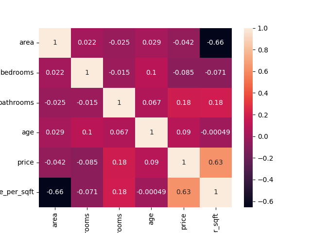
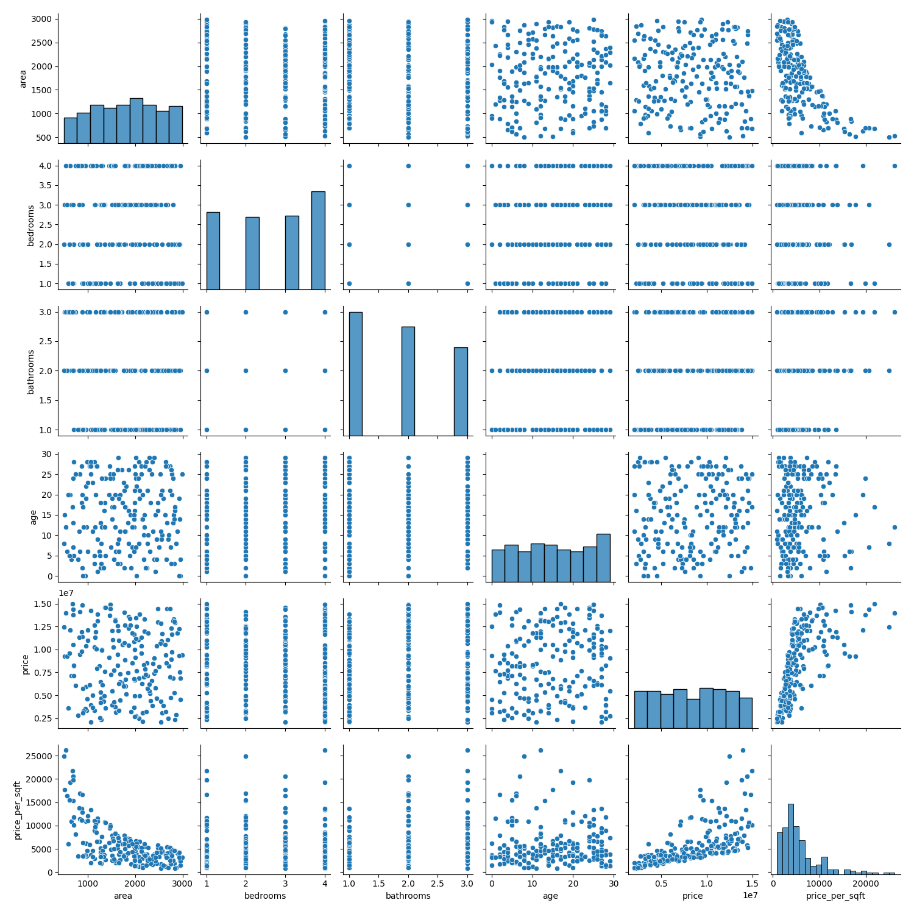
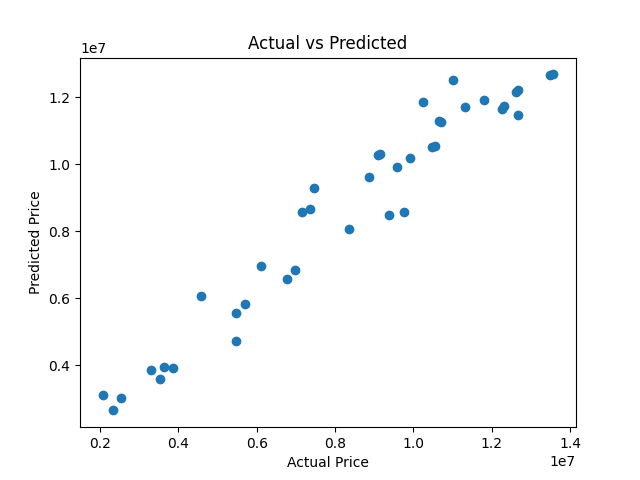
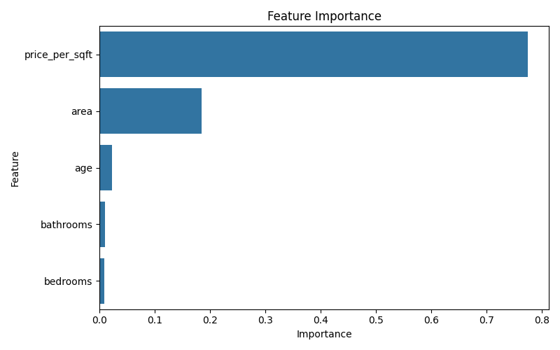

# 🏠 House Price Prediction using Machine Learning

## 📌 Overview

This project builds an **end-to-end Machine Learning system** to predict house prices based on property features such as area, number of bedrooms, bathrooms, and age of the property.

It demonstrates a complete ML workflow including **data preprocessing, feature engineering, model training, evaluation, and deployment using FastAPI**.

---

## 🎯 Problem Statement

Accurately estimating property prices is critical in real estate.
This project uses regression models to **predict house prices and support data-driven decision making** for buyers, sellers, and financial institutions.

---

## 🚀 Key Features

* 📊 Data preprocessing and cleaning
* 🧠 Feature engineering
* 🤖 Multiple regression models (Linear Regression, Random Forest)
* 📈 Model evaluation (MAE, RMSE, R² Score)
* 📉 Data visualization (heatmap, pairplot, prediction graph)
* 🔍 Feature importance analysis
* 🌐 FastAPI-based prediction API

---

## 🛠️ Tech Stack

* Python
* Pandas, NumPy
* Scikit-learn
* Matplotlib, Seaborn
* FastAPI
* Joblib

---

## 📂 Project Structure

```bash id="psh2sd"
House-Price-Prediction/
│
├── data/
├── src/
├── models/
├── outputs/
├── images/
├── api/
├── main.py
├── requirements.txt
└── README.md
```

---

## ▶️ How to Run

### 1️⃣ Setup Environment

```bash id="o7y0z7"
python -m venv venv
venv\Scripts\activate
pip install -r requirements.txt
```

### 2️⃣ Run Project

```bash id="m0k2ti"
python main.py
```

---

## 📸 Project Outputs

### 📊 Correlation Heatmap


### 📈 Pairplot Analysis


### 📉 Actual vs Predicted Prices


### 🔍 Feature Importance


---

## 📈 Model Performance

* Evaluated using:

  * MAE (Mean Absolute Error)
  * RMSE (Root Mean Squared Error)
  * R² Score

---

## 🎯 Learning Outcomes

* End-to-end ML pipeline development
* Regression modeling techniques
* Feature engineering & importance
* Model evaluation and comparison
* API deployment with FastAPI

---

## 🔮 Future Improvements

* Use real-world housing datasets
* Add XGBoost / advanced models
* Deploy using Docker / Cloud
* Build frontend dashboard

---

## 👩‍💻 Author

**Ananya Jain**

---


